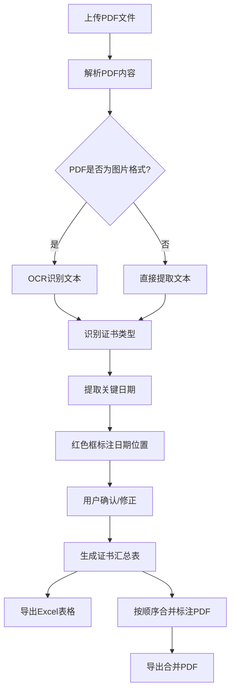

# 船舶证书PDF识别与标注系统 - 产品需求文档

## 1. 产品概述
面向船舶管理行业的在线纯前端工具，用于批量上传船舶证书PDF（含扫描件/图片格式），自动识别签发日期、过期日期、年检日期等关键信息，在PDF上用红色框标注，并生成汇总Excel表格和合并后的标注PDF。
- 解决船舶证书人工核对耗时易错的问题，提升证书管理效率
- 目标用户：船舶管理公司、船级社、港口国监督检查人员

## 2. 核心功能

### 2.1 用户角色
| 角色 | 注册方式 | 核心权限 |
|------|----------|----------|
| 普通用户 | 无需注册，直接使用 | 上传、识别、标注、导出全部功能 |

### 2.2 功能模块
1. **上传页面**：拖拽/点击上传多个PDF文件，显示上传进度和文件列表
2. **识别与标注页面**：展示PDF预览，自动OCR识别日期，红色框标注，支持手动调整
3. **汇总导出页面**：生成证书汇总Excel表格，合并标注PDF并按指定顺序下载

### 2.3 页面详情
| 页面名称 | 模块名称 | 功能描述 |
|----------|----------|----------|
| 上传页面 | 文件上传区 | 拖拽上传或点击选择多个PDF，显示文件名、大小、状态 |
| 上传页面 | 证书分类 | 自动识别证书类型（REG/MM/LL/SC/ISSC/IOPP/TON等），支持手动修改分类 |
| 识别与标注页面 | PDF预览 | 左侧展示PDF原始内容，支持翻页和缩放 |
| 识别与标注页面 | 日期识别 | 右侧显示识别出的签发日期、过期日期、年检日期，支持手动修正 |
| 识别与标注页面 | 红色框标注 | 在PDF上用红色矩形框标注识别到的日期位置，可调整框范围 |
| 汇总导出页面 | 证书汇总表 | 表格展示所有证书的关键日期信息，支持编辑修正 |
| 汇总导出页面 | Excel导出 | 一键导出证书汇总Excel表格 |
| 汇总导出页面 | PDF合并导出 | 按指定顺序合并所有标注PDF并下载 |

## 3. 核心流程

用户上传多个船舶证书PDF → 系统自动解析PDF（文本型直接提取，图片型OCR识别）→ 识别证书类型和关键日期 → 在PDF上红色框标注日期位置 → 用户确认/修正识别结果 → 生成汇总Excel表格 → 按指定顺序合并标注PDF并导出

### 3.1 证书类型与合并顺序
| 顺序 | 证书简称 | 证书全称 | 识别关键词 |
|------|----------|----------|------------|
| 1 | REG | 国籍证书 | Certificate of Registry, REG |
| 2 | MM | 最低安全配员证书 | Minimum Safe Manning, MM |
| 3 | LL | 载重线证书 | Load Line, LL |
| 4 | SC | 安全构造证书 | Safety Construction, SC |
| 5 | ISSC | 保安证书 | International Ship Security, ISSC |
| 6 | IOPP | 防油污证书 | International Oil Pollution Prevention, IOPP, IOPP FORM A |
| 7 | TON | 国际吨位证书 | International Tonnage, TON |

### 3.2 日期识别规则
- **签发日期**：Date of Issue, Issued, Date of Certificate
- **过期日期**：Date of Expiry, Expiry, Valid Until, Expiration
- **年检日期**：Annual Survey, Intermediate Survey, Date of Annual

## 4. 用户界面设计

### 4.1 设计风格
- 主色调：深蓝(#0F2B46) + 海蓝(#1B6CA8) — 呼应海洋/航运主题
- 强调色：红色(#E53E3E) — 用于标注框和重要提示
- 辅助色：暖灰(#F7F8FA)背景 + 白色卡片
- 按钮风格：圆角(8px)，主按钮实色填充，次按钮描边
- 字体：Noto Sans SC（中文）+ Source Sans 3（英文/数字），等宽字体用于日期显示
- 布局：顶部导航 + 左右分栏（PDF预览 | 识别结果）
- 图标：lucide-react 图标库

### 4.2 页面设计概览
| 页面名称 | 模块名称 | UI元素 |
|----------|----------|--------|
| 上传页面 | 文件上传区 | 虚线边框拖拽区，文件列表卡片，证书类型下拉选择 |
| 识别与标注页面 | PDF预览 | Canvas渲染PDF，红色半透明矩形框，翻页控制条 |
| 识别与标注页面 | 日期面板 | 三组日期输入框（签发/过期/年检），置信度百分比 |
| 汇总导出页面 | 证书表格 | 可编辑表格，证书类型排序列，状态标签 |
| 汇总导出页面 | 导出按钮 | Excel导出 + PDF合并导出，进度条 |

### 4.3 响应式设计
- 桌面优先设计（主要使用场景为办公电脑）
- 最小支持1280px宽度，1024px以下隐藏侧边栏
- PDF预览区域自适应容器宽度

## 5. 技术约束
- 纯前端实现，不依赖后端服务
- 所有PDF解析、OCR、标注、合并均在浏览器端完成
- 支持文本型PDF和扫描件/图片型PDF
- 单文件大小限制100MB，总数限制20个
