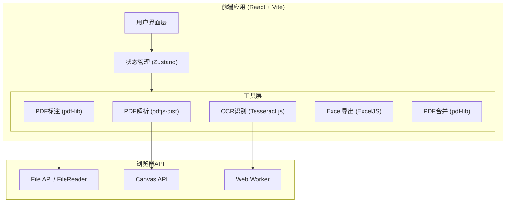

# 船舶证书PDF识别与标注系统 - 技术架构文档

## 1. 架构设计

纯前端单页应用，所有数据处理均在浏览器端完成，无需后端服务。



## 2. 技术说明
- **前端框架**：React@18 + TypeScript + Vite
- **初始化工具**：vite-init (react-ts模板)
- **样式方案**：Tailwind CSS@3
- **状态管理**：Zustand
- **PDF渲染**：pdfjs-dist — 解析PDF内容、渲染Canvas预览
- **OCR识别**：Tesseract.js — 对图片型PDF进行文字识别
- **PDF操作**：pdf-lib — 添加红色标注框、合并PDF
- **Excel生成**：ExcelJS — 创建证书汇总表格
- **路由**：react-router-dom v6
- **图标**：lucide-react
- **后端**：无（纯前端应用）

## 3. 路由定义
| 路由 | 用途 |
|------|------|
| `/` | 上传页面：上传PDF文件、分类证书 |
| `/annotate` | 识别与标注页面：PDF预览、日期识别、红色框标注 |
| `/export` | 汇总导出页面：证书汇总表、导出Excel和合并PDF |

## 4. 核心数据流

### 4.1 PDF解析流程
1. 用户上传PDF → FileReader读取为ArrayBuffer
2. pdfjs-dist加载PDF → 判断是否为图片型（检查页面文本内容是否为空）
3. 图片型PDF → Canvas渲染 → Tesseract.js OCR识别文本
4. 文本型PDF → pdfjs-dist直接提取文本内容及坐标

### 4.2 日期识别流程
1. 提取PDF文本 → 使用正则匹配日期关键词及日期值
2. 记录日期文本在PDF中的位置坐标
3. 返回识别结果：{ type, date, confidence, position }

### 4.3 PDF标注流程
1. 使用pdf-lib加载原始PDF
2. 在识别位置绘制红色矩形框（2pt边框，无填充）
3. 返回标注后的PDF字节流

### 4.4 PDF合并流程
1. 按证书类型排序：REG → MM → LL → SC → ISSC → IOPP → TON
2. 使用pdf-lib逐个复制页面到新文档
3. 导出合并后的PDF

## 5. 数据模型

### 5.1 核心类型定义

```typescript
// 证书类型枚举
type CertType = 'REG' | 'MM' | 'LL' | 'SC' | 'ISSC' | 'IOPP' | 'TON' | 'UNKNOWN';

// 日期类型枚举
type DateType = 'ISSUE' | 'EXPIRY' | 'ANNUAL_SURVEY';

// 识别到的日期信息
interface RecognizedDate {
  type: DateType;
  date: string; // YYYY-MM-DD 格式
  confidence: number; // 0-1 置信度
  page: number; // 所在页码
  position: { x: number; y: number; width: number; height: number }; // PDF坐标
  rawText: string; // 原始识别文本
}

// 证书文件信息
interface CertFile {
  id: string;
  fileName: string;
  fileSize: number;
  certType: CertType;
  pdfBytes: ArrayBuffer; // 原始PDF数据
  annotatedPdfBytes: ArrayBuffer | null; // 标注后PDF数据
  dates: RecognizedDate[];
  status: 'pending' | 'processing' | 'done' | 'error';
  isImageBased: boolean; // 是否为图片型PDF
  error?: string;
}

// 证书合并排序
const CERT_MERGE_ORDER: CertType[] = ['REG', 'MM', 'LL', 'SC', 'ISSC', 'IOPP', 'TON'];
```

### 5.2 Zustand Store 设计

```typescript
interface CertStore {
  files: CertFile[];
  addFiles: (files: File[]) => void;
  removeFile: (id: string) => void;
  updateFile: (id: string, updates: Partial<CertFile>) => void;
  setCertType: (id: string, certType: CertType) => void;
  setDate: (fileId: string, dateIndex: number, date: string) => void;
  getSortedFiles: () => CertFile[];
}
```

## 6. 关键技术实现方案

### 6.1 图片型PDF检测
```
使用 pdfjs-dist 获取页面的 textContent
如果 textContent.items 大部分为空字符串或长度极短 → 判定为图片型PDF
```

### 6.2 OCR处理策略
- 使用 Tesseract.js 的 worker 模式避免阻塞主线程
- 将PDF页面渲染到Canvas → 转为图片 → 送入OCR
- 预设英文语言包(eng)以提升识别精度
- 对日期区域进行针对性识别

### 6.3 日期正则匹配
```regex
// 签发日期
/(Date\s+of\s+Issue|Issued?\s*(on|date)?|Date\s+of\s+Certificate)\s*[:\-]?\s*(\d{1,2}[\s\/\-\.]\d{1,2}[\s\/\-\.]\d{2,4}|\d{1,2}\s+\w{3,9}\s+\d{2,4})/i

// 过期日期
/(Date\s+of\s+Expir|Expir\w*|Valid\s+(Until|To)|Expiration)\s*[:\-]?\s*(\d{1,2}[\s\/\-\.]\d{1,2}[\s\/\-\.]\d{2,4}|\d{1,2}\s+\w{3,9}\s+\d{2,4})/i

// 年检日期
/(Annual\s+Survey|Intermediate\s+Survey|Date\s+of\s+Annual)\s*[:\-]?\s*(\d{1,2}[\s\/\-\.]\d{1,2}[\s\/\-\.]\d{2,4}|\d{1,2}\s+\w{3,9}\s+\d{2,4})/i
```

### 6.4 PDF坐标映射
- pdfjs-dist 的 textContent.items 包含 transform 矩阵，可获取文本在PDF页面中的精确坐标
- OCR模式下通过 Tesseract.js 返回的 bounding box 映射到PDF坐标
- 使用 pdf-lib 的 page.drawRectangle() 在对应位置绘制红色框

### 6.5 性能优化
- OCR处理使用 Web Worker 避免主线程阻塞
- 大文件分页处理，按需加载
- PDF预览使用虚拟滚动，仅渲染可视区域页面
- 合并PDF时流式处理，避免内存溢出
